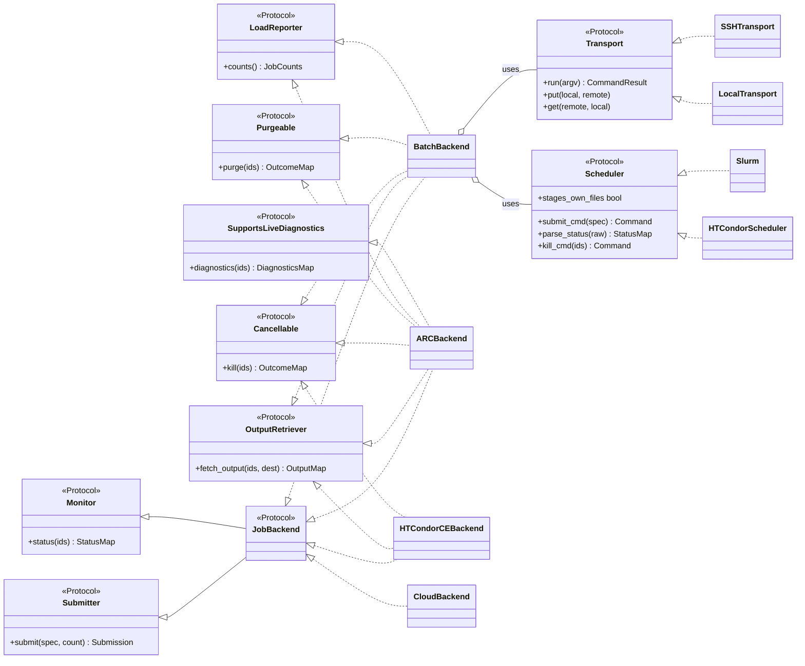
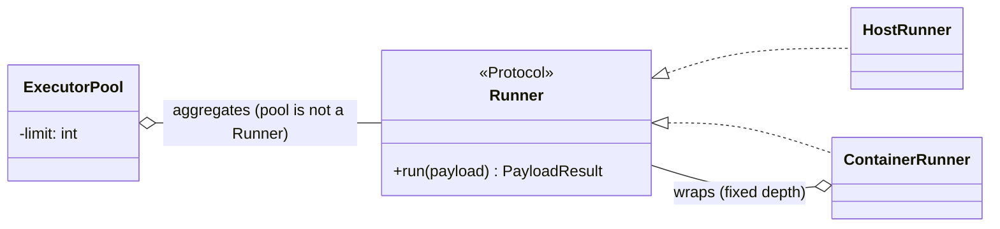

# IC-ADR-001: Computing Element interfaces and the DIRAC to interCEde migration

## Metadata

- **Created By:** Alexandre Boyer
- **Date:** 2026-06-30
- **Status:** Draft
- **Decision Maker(s):** Federico Stagni, Christophe Haen, Chris Burr
- **Stakeholders:** DIRAC/DiracX SiteDirector, PushJobAgent and Pilot maintainers; extension
  communities operating Computing Elements and batch systems; interCEde contributors

> **Scope and altitude.** This is a *direction-setting* ADR. It commits to the **shape** of
> interCEde's Computing Element interfaces and records what is ported from DIRAC's
> `Resources/Computing` and what is deliberately left out. Illustrative code sketches pin down the
> shape; the exhaustive method-by-method signatures, the wire/serialisation details, and the
> per-backend porting mechanics are deferred to follow-up ADRs and to the implementation itself.
> interCEde is a standalone library in the [DIRACGrid](https://github.com/DIRACGrid) ecosystem
> designed to back the Computing Element layer used by
> [DiracX](https://github.com/DIRACGrid/diracx); this ADR is intended to be read alongside the
> DiracX transition ADRs but governs interCEde's own API. (Why a standalone library rather than a
> `diracx` subpackage is recorded in Rejected Ideas.)
>
> **How to read this.** To review the decision, read the Abstract, Motivation, §1–§4 and §7.
> The rest is supporting reference and can be skimmed: §8 (migration map), §9 (consumer sketches),
> the Rejected-Ideas entries you don't want to contest, and the Open Issues backlog.

## Abstract

interCEde gives the workload management layer one payload-agnostic way to **submit, monitor and
retrieve** units of work on heterogeneous Computing Elements (CEs) and batch systems, validated
against containerised backends. This ADR fixes the shape of that interface with five decisions:

1. **The contract is a set of small typed interfaces (`typing.Protocol`s), not a base class.**
   Backends are defined by structural conformance, implement only the capabilities they have, and
   can be mocked without inheriting interCEde types.
2. **Access and scheduling compose instead of multiplying.** A `Transport` (how you reach the
   resource) and a `Scheduler` (how work is queued) combine in one generic `BatchBackend`, so N
   transports × M schedulers costs N+M classes; genuinely monolithic backends (ARC, HTCondor-CE,
   Cloud) implement the contract directly.
3. **DIRAC's in-process CEs (`InProcess`, `Singularity`, `Pool`) leave the library.** They belong
   to the pilot/worker-node domain and get their own `Runner`/`ExecutorPool` subsystem,
   disconnected from this contract.
4. **The data plane handles arbitrary input/output sandboxes**, not only stdout/stderr — the
   direct consequence of never interpreting the payload.
5. **The extension surface is explicit and three-tiered:** stable contracts third parties
   implement, provided implementations they may use but not subclass, and internals with no
   stability guarantee.

## Motivation

### What DIRAC has today

DIRAC's CE machinery lives in `DIRAC/Resources/Computing/`. A base class `ComputingElement` is
subclassed by nine concrete CEs (`AREX`, `HTCondorCE`, `SSH`, `SSHBatch`, `Local`, `Cloud`,
`InProcess`, `Singularity`, `Pool`), instantiated through a `ComputingElementFactory` that
string-loads modules via `ObjectLoader`. A parallel `BatchSystems/` package (`SLURM`, `Condor`,
`LSF`, `GE`, `OAR`, `Torque`, `Host`) provides scheduler plugins that the `SSH`/`Local` CEs
compose via `loadBatchSystem()`.

### Why it needs to change

1. **The base class is a fat class that conflates contract with policy.** `ComputingElement`
   mixes the job-lifecycle contract (submit/status/output/kill) with cross-cutting policy:
   CPU-slot accounting (`available()`), proxy renewal (`_monitorProxy`), and a layered
   configuration hierarchy. Every CE drags this along whether it needs it or not.

2. **The contract is "abstract by convention", and unenforced.** There is no `abc.ABC`, no
   `@abstractmethod`, no Protocol — it is a plain `class ComputingElement:`. What stubs exist
   (`submitJob`, `getCEStatus`) merely `return S_ERROR("…should be implemented in a subclass")`;
   the rest of the lifecycle (`getJobStatus`, `getJobOutput`, `killJob`) is not declared on the
   base **at all**, so nothing — not even a stub — stops a subclass from silently omitting
   `getJobOutput`.

3. **The interface has drifted across implementations.** `submitJob` alone appears as
   `(executableFile, proxy, numberOfJobs, inputs, outputs)` (AREX), `(…, numberOfJobs=1)`
   (HTCondorCE/SSH), `(…, proxy=None, inputs=None, **kwargs)` (InProcess/Pool), and
   `(…, proxy=None, **kwargs)` (Singularity); `proxy` is required in some and optional in others.
   `getJobOutput` appears with four different signatures. Not all CEs implement the same methods.

4. **Three incompatible semantics are crammed under one base.** The base docstring itself
   distinguishes **Remote** (async, pollable, multi-job), **Inner** (synchronous, blocking, one
   job), and **Inner Pool** CEs. They serve *different actors* — Remote CEs are driven by the
   central SiteDirector/PushJobAgent, Inner CEs by the JobAgent inside a pilot — and are never
   substituted for one another. Their *mechanics* don't even overlap (`CGroups2.systemCall` +
   periodic proxy refresh on the inner side vs batch submit/poll/REST on the remote side). The
   shared supertype is a false abstraction.

5. **The good idea — composition — is applied inconsistently.** `SSH`/`Local` compose a transport
   with a `BatchSystems/*` plugin, but `AREX`/`HTCondorCE`/`Cloud` hard-code their scheduler
   interaction, and the `BatchSystems/*` plugins are a separate hierarchy with their own ad-hoc,
   string-generating interface.

6. **The data plane is too narrow.** Only `AREXComputingElement` retrieves arbitrary output files
   (it lists the ARC session directory and streams every file to disk — though even it still
   *returns* only stdout/stderr in memory, `S_OK((output, error))`); every other CE handles only
   stdout/stderr, returning their contents in memory (SSH/Local can instead write them to a
   directory and return paths, but nothing generalises to an arbitrary sandbox). Input staging is
   similarly limited. A payload-agnostic library cannot assume payloads emit only stdout/stderr.

7. **Untyped results and discovery.** Everything is `S_OK`/`S_ERROR` dicts; backends are
   discovered by string-to-module loading. Neither is checkable or pluggable in a typed,
   third-party-friendly way.

### Drivers

- **Payload-agnostic.** interCEde must not care whether the payload is a DIRAC job, a DIRAC
  pilot, or anything else. It submits an opaque executable + sandbox and lets the caller
  poll/fetch/kill.
- **Orchestration-agnostic.** Whether work is *pulled* (SiteDirector) or *pushed* (PushJobAgent)
  is a workload management system concern above interCEde.
- **One contract, many backends**, with *combinations* (`SSH + Slurm`, `SSH + HTCondor`,
  `Local + HTCondor`) as first-class.
- **Tested against the real thing** — backends verified against containerised schedulers, so the
  contract must be trivially implementable and mockable.
- **Extensible by third parties** — VOs must be able to add their own transports, schedulers and
  CEs without forking interCEde.
- **Typed and async** — DiracX is async; results and errors should be typed.

## Specification

### 1. Scope — what interCEde is and is not

interCEde is the **delegate-and-poll** side of running work on a resource: *submit a payload to a
scheduler/resource, get a handle, then poll it, fetch its sandbox, or kill it.* The boundary with
the rest of the system, stated without any pilot/job vocabulary:

- **In scope:** reaching a resource (local shell, SSH, REST/ARC, HTCondor-CE, cloud API);
  queueing work on a scheduler; tracking a remote handle; staging input/output sandboxes.
- **Out of scope — execute-here-and-now:** running a payload *in this process* on a worker node
  (DIRAC's `InProcess`/`Singularity`/`Pool`). This is the pilot/worker-node domain (see §6).
- **Out of scope — orchestration:** pull vs push, matching, pilot lifecycle. interCEde exposes
  mechanism; DiracX/DIRAC decides policy.
- **Out of scope — payload interpretation:** interCEde never inspects payload contents.
- **Out of scope — persistence:** interCEde keeps no store of jobs or handles; the caller
  persists handles and owns idempotency/reconciliation (see §9).
- **Out of scope — other resource types:** Storage Elements, File Catalogs, and the like are
  *different contracts* (data movement; namespace/metadata) with different backends, testing, and
  consumers. They are **sibling libraries, not part of interCEde** — see Rejected Ideas.

The submitted thing is a **`SubmissionSpec`** — the description of an opaque payload (name
provisional; see Open Issues). Submitting a spec, optionally `count` identical times, returns one
**`Submission`**, which bundles one **`JobHandle`** per created job plus any per-copy failures.

**Throughout this ADR, "job" means the *scheduler's* job (a Slurm/Condor job) — explicitly *not*
a DIRAC Job.** The naming deliberately reserves `Job*` for the backend handle and avoids
`Payload`, which collides with the pilot-side payload concept (see Open Issues).

A `JobHandle` is the durable, serialisable identity of one job: the caller persists it and later
replays it into status/output/kill calls. It must therefore be stable across processes and carry
whatever *routing* the backend needs to find the job again (e.g. the target host that DIRAC's
`sshcondor://…` scheme used to encode — see §8).

### 2. The contract — capability-segmented Protocols

The caller-facing contract is a set of small `typing.Protocol`s, and **every operation works on
many jobs at once**: submit fans a single spec into `count` identical jobs; status/output/kill/
purge take a sequence of ids and return a mapping keyed by `JobID`, so every per-item outcome is
addressable (see the partial-failure rule below).

The contract is sized by its consumers. DiracX splits the old monolithic SiteDirector into
independent, separately-scheduled **tasks** — one submits, one polls status, one fetches outputs
(§9 sketches them). The **essential** capabilities of a CE are two — *submit a payload (with
inputs)* and *get the jobs' status* — each driven by its own task. *Retrieving outputs* is a
third task and its own protocol, but it is **optional, not essential**: some backends genuinely
cannot serve a pull-style sandbox retrieval — the canonical case is **Cloud**, where a booted VM
has no server-side filesystem interCEde controls, so exporting outputs is the payload's own
responsibility (e.g. pushing them to an object store) — and the ADR's rule is *never force a
backend to stub a capability it lacks*. So `OutputRetriever` sits with the optional capabilities,
and the output task narrows to it structurally.

```python
StatusMap = Mapping[JobID, JobStatus]        # named alias, stable (Tier A)

@runtime_checkable
class Submitter(Protocol):                   # the submission task
    async def submit(self, spec: SubmissionSpec, count: int = 1) -> Submission: ...
    # submit the SAME spec `count` times (DIRAC's numberOfJobs); returns one Submission
    # bundling one JobHandle per successful copy, plus per-copy failures

@runtime_checkable
class Monitor(Protocol):                      # the status task
    async def status(self, ids: Sequence[JobID]) -> StatusMap: ...
    # ids the backend no longer knows come back as JobStatus.UNKNOWN — never dropped

@runtime_checkable
class JobBackend(Submitter, Monitor, Protocol): ...
```

`OutputRetriever` and the other capabilities are additive and optional (below). `JobBackend` is
the composition of the two essential protocols; it names "a complete backend" and is what the
registry returns and validates. But **consumers depend on the narrow protocol they use, not on
`JobBackend`** — the submission task takes a `Submitter`, the status task a `Monitor`, the output
task an `OutputRetriever` (which it must confirm structurally, since a backend may lack it). A
backend implements the slices it can, and each task is handed the same object but sees only its
slice.

> **Naming — why `JobBackend`, not `ComputingElement`.** interCEde types name *what interCEde
> provides* — a backend the WMS drives — never the external resource. The composed contract is
> `JobBackend` (it pairs with `JobHandle`/`JobID`/`JobStatus`); a Slurm-over-SSH `BatchBackend`
> is emphatically *not* a Computing Element in the WLCG sense, and the concrete drivers
> (`ARCBackend`, `HTCondorCEBackend`, `CloudBackend`) are clients *of* resources, not the
> resources themselves. The domain term "Computing Element / CE" stays in prose and docstrings.
> The one retained "CE" is `HTCondorCEBackend`: there "CE" names the external product
> (HTCondor-CE, a grid gateway distinct from the local `HTCondorScheduler`), not a claim that the
> class *is* a CE.

> **The registry gate is a smoke-test, not the drift guard.** `isinstance` against a
> `@runtime_checkable` Protocol checks method **presence only, never signatures** — a backend
> whose `submit` has an extra required argument, or that forgot `async`, passes the gate and
> fails only at the first call. The real defence against DIRAC-style signature drift is (a)
> static typing for first-party code and (b) the **container conformance suite**, which is
> therefore a *requirement* of registration, not optional (see §5, Evolution). (Two PEP 544
> mechanics for implementers: keep `Protocol` in the base list when composing protocols, or the
> subclass silently becomes a concrete class; and `@runtime_checkable` is not inherited — the
> composed `JobBackend` must carry the decorator itself.)

**Everything else is optional** — additive, independent protocols, *not* part of `JobBackend`,
each justified by a real caller and by backends that have it and don't. All are bulk and return a
per-`JobID` outcome map (`kill`/`purge`/`fetch_output` never return bare `None`, so a
partial-batch failure is always reportable):

```python
@runtime_checkable
class OutputRetriever(Protocol):              # the (on-demand) output task — OPTIONAL
    # Bulk: materialise each job's whole output sandbox (incl. the CE/scheduler log) into
    # `dest`. No separate log fetch — the log is a manifest member. Retrieval is IDEMPOTENT
    # by default (ARC/SSH/Local keep remote state and can be re-fetched); a backend whose
    # retrieval is physically one-shot DECLARES it via `destructive` — e.g. HTCondor
    # (>= 25.8), where a completed spooled job leaves the queue after `condor_transfer_data`
    # (overridable via `leave_in_queue`). interCEde never *forces* destructiveness on a
    # re-fetchable backend; the consumer reads `destructive` to know whether `dest` is a
    # hard commit point or a re-fetchable cache.
    destructive: bool                         # False for ARC/SSH/Local; True for HTCondor (>= 25.8)
    async def fetch_output(self, ids: Sequence[JobID], dest: Path) -> Mapping[JobID, JobOutput]: ...

@runtime_checkable
class Cancellable(Protocol):
    async def kill(self, ids: Sequence[JobID]) -> Mapping[JobID, OpOutcome]: ...

@runtime_checkable
class Purgeable(Protocol):
    # Delete a job's outputs/remote state WITHOUT fetching them — the counterpart to the
    # destructive fetch. Needed on its own where a site mandates scratch/spool cleanup
    # even for outputs no one will retrieve.
    async def purge(self, ids: Sequence[JobID]) -> Mapping[JobID, OpOutcome]: ...

@runtime_checkable
class LoadReporter(Protocol):
    # Aggregate counts of *our* submitted jobs — NOT a capacity number, NOT "available
    # slots" (that is the caller's throttling policy). HTCondor-CE cannot provide this at
    # all (`getCEStatus()` returns an explicit `S_ERROR("… not supported")`).
    async def counts(self) -> JobCounts: ...        # {running, waiting}

@runtime_checkable
class SupportsLiveDiagnostics(Protocol):
    # An independent, repeatable diagnostics fetch *before* completion — ARC is the
    # clear case (its `diagnose/errors` endpoint); whether HTCondorCE's spool log-peek
    # qualifies is an Open Issue. The *final* log is always a member of the
    # fetch_output manifest, so there is no standalone "get the final log" method.
    async def diagnostics(self, ids: Sequence[JobID]) -> Mapping[JobID, Diagnostics]: ...
```

The comment on `OutputRetriever.destructive` above is the **single normative statement** of the
destructive-retrieval model; every other mention in this ADR cross-references it.

**Partial failure is per item, not per batch.** A bulk call raises a typed exception only for a
whole-operation failure (transport down, auth rejected); anything that can succeed for some ids
and fail for others reports it in the returned map — `status` yields `JobStatus.UNKNOWN` for
unknown/expired ids, and `kill`/`purge`/`fetch_output` yield a per-id `OpOutcome` (ok / error).
Callers never have to guess which ids a partial batch touched.

**Backends have an explicit lifecycle, because consumers cache them.** DIRAC already proves both
halves: `QueueCECache` caches CE objects keyed on a hash of their parameters, reuses them across
agent cycles, and calls `shutdown()` on eviction (with an explicit "eviction must never fail"
guard), and the SSH CE's `shutdown()` closes per-host connections *and the ssh jump-gateway* —
yet the base class declares no lifecycle contract at all, so eviction relies on `shutdown()`
being "polymorphic by convention". interCEde backends and transports hold the same kind of state
(SSH connections, HTTP sessions), so the lifecycle is part of the Tier-A contract: **backends and
transports are async context managers** — construction is cheap and side-effect-free (no I/O
before first use), close is idempotent, and a consumer that caches backends owns closing them on
eviction. This is also what makes the statelessness rule (§9) honest: the *only* resources a
backend holds are connections, released deterministically, never job state.

**Decision rule for segmentation:** one protocol per capability a *specific caller wants in
isolation*. The DiracX-task split makes that concrete — submit and status are two separate tasks
(so two essential protocols), and output-retrieval is a third task narrowed to an *optional*
`OutputRetriever` (an earlier draft bundled status+fetch into one "operator"; the task topology
shows that was too coarse). `kill` and `purge` are management actions some flows never use; the
submission task's throttling wants `LoadReporter`; the WMS matcher wants none of this. Do not
segment further than a caller exists for — that discipline is what prevents drift back into a
god-interface.



(The two essential protocols compose into `JobBackend`; output-retrieval and the rest are
optional and picked up à la carte. `ARCBackend` adds `OutputRetriever` plus all four optional
capabilities. `HTCondorCEBackend` adds `OutputRetriever` and `Cancellable` only — it reports no
counts, offers no independent diagnostics, and its retrieval is destructive (§2).
`CloudBackend` implements only the essential `Submitter`+`Monitor` — it deliberately does *not*
claim `OutputRetriever` (§2).)

### 3. Composition — `Transport` × `Scheduler`

Most backends are really two orthogonal choices: **access/transport** (how you reach the
resource) and **scheduler** (what queues the work). `Transport` and `Scheduler` are
*collaborator* protocols — they are **not** sub-protocols of `JobBackend`. Their relationship to
the contract is realised by composition:

```python
class BatchBackend:                 # satisfies JobBackend
    def __init__(self, transport: Transport, scheduler: Scheduler): ...
```

This one class covers `SSH + Slurm`, `SSH + HTCondor`, `Local + Slurm`, … — the matrix collapses
from *transports × schedulers* to *transports + schedulers*. Backends that are not
"transport + scheduler" (ARC is a REST service fronting an opaque batch system; Cloud boots a VM
and has no scheduler) implement `JobBackend` directly. The Protocol is what lets composed and
monolithic implementations sit behind one caller-facing type.

Cloud is the clearest case of *why* composition does not always apply. Batch has **two
independent axes** — any `Scheduler` behind any `Transport` — which is what makes the N×M → N+M
collapse worthwhile. Cloud has **one** axis, the provider (OpenStack/EC2/OpenNebula/…), and "how
you reach it" and "what it is" are *fused* into a single Apache Libcloud driver — there is no
matrix to collapse. So `CloudBackend` is **not** `BatchBackend(libcloud, opennebula)`: Libcloud
is not a `Transport` (no shell to `run` argv, no filesystem to `put`/`get`) and a provider like
OpenNebula is not a `Scheduler` (no queue, no submit/parse-status commands). The provider axis
*is* a composition, but Libcloud already owns it (its `get_driver`/`set_driver` registry);
`CloudBackend` is a monolithic `JobBackend` that composes Libcloud **internally** (Tier C, §8),
which is why the provider drivers do not appear as collaborators in the class diagram.

**Staging is a Transport × Scheduler interaction, and the `Scheduler` carries it.** Who moves the
sandbox is not purely a transport choice: HTCondor declares its file transfer *in the submit
description at submit time* (`should_transfer_files`, `transfer_output_files`) and stages
worker→schedd itself, whereas a Slurm-over-SSH combination declares nothing to the scheduler and
interCEde stages the sandbox over the transport (`put`/`get`) at fetch time. `BatchBackend` must
not hard-code this per scheduler, so the `Scheduler` protocol exposes it as data — a
`stages_own_files` flag (and, where needed, `stage_inputs`/`collect_outputs` hooks).
`BatchBackend.submit()` consults the flag instead of branching on scheduler identity, which is
what keeps "add a scheduler by implementing the protocol, no core change" true even for a
scheduler whose transfer model differs from the reference one.

**Shared batch-system knowledge.** A backend family's command construction and output parsing —
building a `condor_submit` description, parsing `condor_q`/`condor_history` ClassAds, mapping
native states to `JobStatus` — lives in *one* internal module (`_htcondor`, `_slurm`, …) consumed
by **both** the `Scheduler` adapter and any related monolithic CE. `HTCondorScheduler` (used by
`BatchBackend` for SSH/Local + HTCondor) and `HTCondorCEBackend` (a remote schedd reached over a
grid/CE transport, with tokens and the grid universe) share that core and differ only in
transport/auth and submit-description routing. That overlap is itself a hint that
`HTCondorCEBackend` might eventually be expressed as
`BatchBackend(HTCondorCETransport, HTCondorScheduler)` rather than a monolith (see Open Issues).
The rule is the same one from §6: **share implementation as functions/internal modules, never by
making one a subtype of the other.**

**No interpreter on the remote host.** DIRAC's SSH/Local CEs work by *shipping* a Python driver
to the resource (`BatchSystems/<X>.py` concatenated with `executeBatch.py`, uploaded and executed
by whatever Python the host provides — the file itself warns "support for py2 and py3 is
necessary"), which is why those drivers are stdlib-only, DIRAC-free, and stuck on 2014-era
conventions. interCEde deliberately drops the ship-and-exec model: `Scheduler`s build commands
*locally* and only argv (plus staged sandbox files) crosses the `Transport`. The remote host
needs the scheduler CLI and a shell — no Python, no shipped code, no py2 constraint. This is a
portability gain worth advertising and a behavioural change worth testing: the integration suite
should assert it with a batch-host variant that has no usable interpreter (IC-ADR-002 §7).

### 4. Data plane — payload and sandbox

DIRAC's stdout/stderr-only model is generalised to **arbitrary input/output sandboxes**. This is
not a feature bolt-on; it is the *same requirement* as payload-agnosticism — if interCEde does
not interpret the payload, it cannot assume the payload emits only stdout/stderr. stdout/stderr
become two well-known **members** of the output sandbox; the executable becomes one distinguished
member of the input sandbox.

```python
@dataclass
class SubmissionSpec:               # the opaque payload (name provisional — see Open Issues)
    executable: str
    arguments: list[str]
    input_sandbox: list[FileRef]    # files/dirs (or streams) staged in before the run
    output_sandbox: OutputSpec      # explicit names | globs | "everything produced"
    resources: Resources
    environment: Mapping[str, str]
    tag: str | None = None          # consumer-set token, reserved for post-crash
                                    # reconciliation (list-by-tag — see Open Issues)
```

Rules:

- **Declared at submit, materialised at fetch.** HTCondor needs `transfer_output_files` *in the
  submit description*, so the output-sandbox spec lives in `SubmissionSpec`, not only as a
  fetch-time argument. Permissive backends (ARC lists the session dir; SSH globs the remote
  workdir) may also discover outputs at fetch time, so `OutputSpec` expresses both explicit lists
  and globs/"all".
- **Caller-owned inputs are consumed at submit.** `submit()` stages (or copies) the executable
  and every `input_sandbox` member *during the call* and retains no reference to caller-owned
  paths after it returns — the caller may delete its temp files immediately. This rule removes a
  DIRAC wart by construction: today the SiteDirector deletes the submitted executable *unless*
  the CE returns `ExecutableToKeep` (HTCondorCE does, because it still needs the file on disk
  afterwards), a hidden ownership handshake no other CE participates in.
- **Return paths, not contents — and stream.** `fetch_output(ids, dest)` streams each member into
  `dest` and returns, per job, a **manifest** (`JobOutput` with `.stdout`, `.stderr`,
  `.files[...]`, and `.log`); it never loads file contents into memory. This is the one model
  that survives multi-GB outputs.
- **Staging is delegated or synthesised.** "Stage a sandbox" is either delegated to the backend's
  native mechanism (ARC session dir, HTCondor file transfer) or synthesised by interCEde over the
  transport (`Transport.put`/`get`), selected by the scheduler's `stages_own_files` flag (§3).
  The composed CEs get arbitrary sandboxes *for free* because the transport already provides
  `put`/`get`.
- **One manifest, one retrieval.** `fetch_output` materialises stdout, stderr, output files
  **and** the CE/scheduler log together into `dest`, as members of a single manifest. The
  manifest separates **CE/scheduler artifacts** (the log — infra-level, interCEde's to expose)
  from **payload artifacts** (fetched, never interpreted). Whether the fetch also *releases* the
  remote state is the backend's declared `destructive` property (§2) — when it is declared, the
  consumer must treat the local `dest` as the commit point (§9). There is no standalone "get the
  final log" call; a *while-running* diagnostics fetch exists only where it is genuinely
  independent and non-destructive (`SupportsLiveDiagnostics`, §2). `purge(ids)` on its own still
  deletes a job's outputs/remote state *without* fetching — the path a site takes when it
  mandates scratch cleanup for outputs no one will retrieve (`Purgeable`, §2).
- **Bounded materialisation, enforced where interCEde does the copy.** "Everything produced" plus
  arbitrary filenames from a payload interCEde never inspects means `fetch_output` needs a size
  ceiling, a file-count ceiling, a per-transfer timeout, and path containment (every member lands
  **under** `dest`; `..`/absolute members are rejected). How much is enforceable inline depends
  on who does the copy: where interCEde streams file-by-file itself (ARC, SSH) all four limits
  apply mid-stream; where the backend's own tool does the transfer (HTCondor) enforcement is
  coarser — a submit-time allow-list, a timeout on the transfer command, and a post-transfer
  size/count check. The limits are stated per backend rather than assumed uniform.

Results are typed dataclasses/models; whole-operation failures raise a **typed exception
hierarchy** (replacing `S_OK`/`S_ERROR`) while per-item outcomes are returned in the bulk map
(§2). The contract is **`async`, and async is the single source of truth**: the backends are all
I/O-bound (SSH, ARC/cloud REST, subprocess) and the contract is bulk, so async is the natural
model for polling/fetching many jobs concurrently. A sync-only backend library (the `htcondor`
bindings, Libcloud, a batch CLI) is wrapped in a thread internally (`asyncio.to_thread`), never
surfaced as a second contract — backends implement only the async protocols. Sync *callers*
(DIRAC during the transition) are served by a thin sync **facade** that runs the async calls to
completion, **not** by a parallel sync API (see Open Issues); a sync caller still benefits from
the bulk fan-out, which runs concurrently *inside* each run-to-completion call.

### 5. Discovery — registry and entry points

`ComputingElementFactory` + `ObjectLoader` string-to-module loading is replaced by a typed
**registry** populated through Python **entry points**. Three groups, one per pluggable kind:

```toml
# a backend package's pyproject.toml
[project.entry-points."intercede.backends"]
arc         = "intercede.backend.arc:ARCBackend"
htcondor-ce = "intercede.backend.htcondor:HTCondorCEBackend"

[project.entry-points."intercede.transports"]
ssh   = "intercede.transport.ssh:SSHTransport"
local = "intercede.transport.local:LocalTransport"

[project.entry-points."intercede.schedulers"]
slurm    = "intercede.scheduler.slurm:Slurm"
htcondor = "intercede.scheduler.htcondor:HTCondorScheduler"
```

How it resolves:

- **Lazy, typed lookup.** The registry reads the entry-point groups on first use but imports only
  the *one* target a request names — no eager import of every backend. Each resolved object is
  checked for structural conformance (`isinstance` against the relevant `@runtime_checkable`
  protocol) at the boundary, so a misregistered class fails fast with a clear error instead of at
  the first method call.
- **A CE is described by data, not a class name.** A request is a small typed config —
  `{"type": "arc", ...}` for a monolithic backend, or `{"transport": "ssh", "scheduler": "slurm",
  ...}` for a composed one. For the composed form the registry instantiates the named transport
  and scheduler and wraps them in `BatchBackend`; the *combination* never needs its own
  registered class, which is what keeps the matrix at N+M.
- **Third parties register without forking.** A VO ships a package advertising any of the three
  groups (an in-house scheduler, a site-specific transport, a bespoke CE); it is discovered
  automatically once installed in the same environment. Nothing in interCEde is edited, and the
  package depends only on Tier-A protocols.
- **Discoverable and versioned.** Unlike `ObjectLoader`, the mapping from a short stable name
  (`"slurm"`) to an implementation is owned by the providing package's metadata, versioned with
  it, and enumerable (`importlib.metadata.entry_points`) for tooling and diagnostics ("what
  backends does this environment offer?").
- **Explicit override precedence.** Name collisions resolve by a documented rule (e.g. a
  configured allow-list / last-installed-wins) so a site can shadow a built-in scheduler with its
  own without patching interCEde.

### 6. The severed "inner" subsystem (out of scope, recorded for completeness)

`InProcess`, `Singularity` and `Pool` move to the **pilot/worker-node domain** with their own
contract, completely disconnected from `JobBackend`, and deliberately **not** modelled as
backends at all (in DIRAC they were lumped under the same `ComputingElement` base, and that
shared name is what created the false unity). Their relationship is a **depth-1 aggregator** —
*not* the full (recursive) Composite pattern, because pools-of-pools are unwanted:

- `Runner`: execute one payload. `HostRunner` (was `InProcess`) runs it directly;
  `ContainerRunner` (was `Singularity`) is a **decorator** that wraps another `Runner`'s command
  in a container. Decoration is a *fixed-depth* `Runner → Runner` edge (a container around a host
  runner), not aggregation — it composes exactly one runner, never a collection.
- `ExecutorPool` (was `Pool`): aggregates a collection of `Runner`s and adds bounded concurrency.
  The restriction that matters is that **`ExecutorPool` is not itself a `Runner`** (the child
  edge is typed `ExecutorPool → Runner`); since a pool is not a runner, it cannot be a child of
  another pool. That is what makes pools-of-pools unrepresentable — without forbidding the
  bounded, non-recursive `ContainerRunner`-over-`HostRunner` decoration.



This subsystem is tracked as separate work (likely against the Pilot repo); it is named here only
so the migration map is complete. One scope warning for that work, from the consumer analysis:
the JobAgent-side contract is richer than `run(payload)`. It also covers
*description-for-matching* (`getDescription()` — where Pool returns a **list** of CE dicts
implementing the MultiProcessor tag strategy), *filling-mode accounting* (`setCPUTimeLeft()`),
*asynchronous result harvesting* (the mutable `taskResults` dict plus the `AsyncSubmission`
flag), and Pool's per-job writes to `pilot.cfg`. The sibling ADR must scope all four, not just
execution.

### 7. Extension surface — what is extendable, and what is not

interCEde is a library implemented and mocked by others, so its public surface is defined
**explicitly** and governed by SemVer. Every public module declares `__all__`; anything not in a
public module's `__all__`, and any module or name prefixed with `_`, is internal and may change
without notice. Three tiers:

**Tier A — Stable contracts (implement these).** The extension points third parties build
against. Breaking changes are SemVer-major.

- The protocols: the essential `Submitter`, `Monitor` and their composition `JobBackend`; the
  collaborators `Transport`, `Scheduler`; and the optional capability protocols
  (`OutputRetriever`, `Cancellable`, `Purgeable`, `LoadReporter`, `SupportsLiveDiagnostics`, …).
- The data types and enums: `SubmissionSpec` (name provisional — see Open Issues), `Submission`
  (bundles `.handles` and `.failures`), `JobHandle` (durable, serialisable, routing-carrying) and
  its identity `JobID`, `JobStatus` (incl. `UNKNOWN`), `StatusMap`, `JobOutput`, `OpOutcome`,
  `JobCounts`, `Diagnostics`, `Resources`, `FileRef`, `OutputSpec`.
- The exception hierarchy (a single rootable `InterCEdeError`).
- The registry API and entry-point group names.
- The lifecycle: backends and transports are async context managers (§2) — cheap,
  side-effect-free construction; idempotent close; consumers that cache them own eviction-time
  closing.

**Tier B — Provided implementations (instantiate and register; do not subclass).** Public to
*use*, not a subclassing contract. Extend by **implementing a protocol or composing**, never by
subclassing these.

- `BatchBackend`; the concrete transports (`SSHTransport`, `LocalTransport`, …); the concrete
  schedulers (`Slurm`, `HTCondorScheduler`, `LSF`, `SGE`, `OAR`, `Torque`, `Direct`); the
  monolithic CEs (`ARCBackend`, `HTCondorCEBackend`, `CloudBackend`).
- An **optional** convenience base, `BaseBackend(ABC)`, may carry *shared mechanics only* (config
  normalisation, logging, retry/timeout helpers) and exposes a small, documented set of
  overridable hooks. It is **not** the contract: a fully-conformant CE can be written without it,
  and policy (slot accounting, credential renewal) is **not** placed in it. Because "no policy,
  by convention" is exactly the DIRAC weakness this ADR indicts, two guardrails keep it from
  re-accreting into a fat base: (1) the helpers it may contain are a **closed, enumerated set**,
  and a unit test asserts it exposes *no* lifecycle method (`submit`/`status`/`fetch_output`/
  `kill`) and *no* policy method (anything like DIRAC's `available()`/`_monitorProxy`); (2)
  interCEde's **own** monolithic CEs do **not** subclass it — so it can never become load-bearing
  inside interCEde the way DIRAC's base became load-bearing in nine places. It exists for
  third-party convenience and is tested against the same conformance suite as any other backend.

**Tier C — Internal (do not import).** Command builders, output parsers, transport internals,
materialisation/retry machinery, anything under a `_`-prefixed module. No stability guarantee.

The guiding rule, and the single most important lesson from DIRAC's fat base: **the preferred
extension mechanism is composition + structural typing, not inheritance.** You add a backend by
implementing a Tier-A protocol and registering it — not by subclassing a Tier-B class.

### 8. DIRAC → interCEde migration map

The map records *where each DIRAC piece lands*. Method-by-method porting mechanics (DIRAC's
job-ref formats, `S_OK` payload keys, CS parameter names) belong to the migration mapping
document owned by the sync-facade work (see Open Issues), not to this table.

| DIRAC (`Resources/Computing`) | interCEde destination | Notes |
| --- | --- | --- |
| `AREXComputingElement` | `ARCBackend` (`JobBackend` + all four optional capabilities + `OutputRetriever`) | REST; reference implementation of the full sandbox model; `killJob` → `kill`, `cleanJob` → `purge`; the `diagnose` endpoint → `SupportsLiveDiagnostics` |
| `HTCondorCEComputingElement` | `HTCondorCEBackend` (monolithic; `JobBackend` + `OutputRetriever` + `Cancellable`) | native file transfer; destructive fetch (§2); no `LoadReporter` (reports no counts); shares the internal `_htcondor` core with `HTCondorScheduler` — composition candidate (Open Issues) |
| `SSHComputingElement` | `BatchBackend(SSHTransport, <Scheduler>)` | composition; sandbox via `Transport.put`/`get` |
| `SSHBatchComputingElement` | `BatchBackend(SSHMultiHostTransport, Direct)` | host routing moves into `JobHandle`; host-spreading is placement *policy* (Open Issues) |
| `LocalComputingElement` | `BatchBackend(LocalTransport, <Scheduler>)` | remote-family despite the name; its spoofed `ssh<batch>://` job-ID hack is dropped — routing lives in `JobHandle` (§1) |
| `CloudComputingElement` | `CloudBackend` (monolithic; essential protocols only) | no `OutputRetriever` (§2); `cleanupPilots` → `purge` |
| `CloudProviders/{OpenNebula,…}` | custom Apache Libcloud `NodeDriver`s — Tier-C internals of `CloudBackend` | provider selection stays delegated to Libcloud (§3, Rejected Ideas); VO-pluggability open |
| `BatchSystems/{SLURM,Condor,LSF,GE,OAR,Torque,Host}` | `Scheduler` implementations (`Slurm`, `HTCondorScheduler`, `LSF`, `SGE`, `OAR`, `Torque`, `Direct`) | promoted from ad-hoc string plugins to the typed protocol; ship-a-python-driver model dropped (§3) |
| `BatchSystems/TimeLeft/*` | **out of scope as an interface** → pilot/worker-node side | queried from *inside* an allocation — a different vantage than the submission-side `Scheduler` (Open Issues) |
| `ComputingElementFactory` (`ObjectLoader`) | typed registry + entry points (§5) | |
| `submitJob` (all remote CEs) | essential `Submitter.submit` | inputs consumed at submit — the `ExecutableToKeep` handshake disappears (§4) |
| `getJobStatus` (all remote CEs) | essential `Monitor.status` | |
| `getJobOutput` (all remote CEs) | **optional** `OutputRetriever.fetch_output` | optional because some backends cannot serve pull-retrieval (§2) |
| `killJob` / `cleanJob` (remote CEs) | optional `Cancellable.kill` / `Purgeable.purge` | not essential — some flows never use them |
| `ComputingElement` base — `getCEStatus()` counts | optional `LoadReporter` (counts only) | the *availability* computation (counts vs `Max*Jobs`) is **caller policy**, removed from interCEde |
| `ComputingElement` base — `shutdown()` (+ `QueueCECache` eviction) | async context-manager lifecycle (§2) | |
| `ComputingElement` base — `setProxy`/`setToken`/`_monitorProxy` | **split**: backend auth → [IC-ADR-003](IC-ADR-003_credentials.md); *payload* proxy renewal → pilot/runner side | |
| `ComputingElement` base — config hierarchy | a loader utility (Tier C), not a base-class responsibility | |
| `InProcessComputingElement` | **out of scope** → `HostRunner` (pilot/runner subsystem, §6) | severed |
| `SingularityComputingElement` | **out of scope** → `ContainerRunner` (decorator over a runner, §6) | severed |
| `PoolComputingElement` | **out of scope** → `ExecutorPool` (depth-1 aggregator, §6) | severed |

### 9. Consumer interface — how DiracX uses interCEde

The consumer surface is deliberately small: the Tier-A protocols plus the registry factory.
DiracX splits the old monolithic SiteDirector into **separate tasks**, and each one is typed to
the *narrowest* protocol it needs — never to `JobBackend`, never to a concrete class. The
registry resolves the same backend for all of them; each task sees only its slice. One sketch —
the submission task; the status and output tasks follow the same resolve-narrow-drive pattern:

```python
from intercede import registry, Submitter, LoadReporter

async def submission_task(resource, want, make_payload):
    ce: Submitter = registry.backend(resource)               # isinstance-checked at the boundary
    if isinstance(ce, LoadReporter):                         # optional -> structural narrowing
        want = min(want, policy.slots(await ce.counts()))    # throttling policy is DiracX's
    spec = make_payload()                                    # -> one SubmissionSpec
    sub = await ce.submit(spec, count=want)                  # same spec, `want` identical copies
    await store.record(sub.handles)                          # DiracX owns this store
    # sub.failures carries any copies the backend rejected, addressable per copy
```

- **The status task** depends on `Monitor` only: it polls and records (`store.update(await
  ce.status(handles))`), with unknown ids coming back as `JobStatus.UNKNOWN` so nothing is
  silently lost. It literally *cannot* call `fetch_output` — which both documents intent and
  keeps output transfers out of the polling loop.
- **The output task** first confirms the backend has the *optional* `OutputRetriever` at all
  (`isinstance` narrowing; Cloud lacks it, §2) and fetches into a durable `dest`. When the
  backend declares `destructive` (§2), the remote copy is gone once the call returns, so `dest`
  is the commit point — upload from there, and on a crash resume from `dest`, never re-fetch.

What this fixes on the contract side:

- **Restart re-drives handles; durability is DiracX's.** Tasks re-resolve the backend and drive
  their slice on handles **reloaded from the DiracX store** — they never submitted anything in
  this process, and interCEde never stored anything. This is why `JobHandle` must be serialisable
  and self-contained (§1).
- **The submit→record window is the consumer's to close (interCEde is stateless).** A crash after
  `submit` returns but before `store.record` commits leaves jobs on the backend that DiracX has
  no handle for. This is not new — DIRAC's SiteDirector has the identical window today — and
  interCEde cannot fix it, having no store; the candidate closing mechanism (tag-at-submit +
  list-by-tag, using the reserved `tag` field from §4) is an Open Issue.
- **Pull vs push is invisible to interCEde.** A pull SiteDirector and a push PushJobAgent run the
  *same* submission task; only *where the payload comes from and when* differs, and that lives in
  the consumer.
- **Policy is the consumer's, mechanism is interCEde's.** Every `policy.*` call (throttling,
  expiry, retries, "what is a pilot") is consumer-side; interCEde supplies only the verbs.
  Optional capabilities are reached by structural narrowing, never assumed.

## Rationale

- **Protocols over a fat base class.** The thing callers depend on is a *contract*; a Protocol
  expresses it without coupling implementations to interCEde's base, which is exactly what a
  library implemented by third parties and mocked against containers needs. DIRAC's pain came
  from the opposite: a fat base plus "abstract by convention" stubs with no enforcement and
  drifting signatures. `@runtime_checkable` keeps an `isinstance` gate at the registry boundary;
  a real `@abstractmethod` ABC is available where forcing an override is genuinely wanted.
- **Composition over inheritance for access × scheduler.** Inheritance forces N×M leaf classes or
  fragile multiple inheritance; composition makes it N+M and is the literal expression of the
  project's "backends combine" promise. DIRAC already proved the bone is sound (`SSH` +
  `BatchSystems`); interCEde just applies it uniformly and gives the scheduler side a real typed
  contract. This is well-trodden ground: HTCondor's **blahp** translates one protocol into
  per-LRMS submit/status/cancel scripts, and ALICE's JAliEn has per-batch `BatchQueue` drivers —
  the `Scheduler` protocol is the same idea, in typed Python. Their async
  request-id/`RESULTS`-poll model is also why interCEde's contract is async, bulk, and poll-based
  (§2) rather than blocking (see Rejected Ideas for why we reimplement rather than reuse them).
- **Capability segmentation, sized by real callers.** Interface Segregation, with the DiracX-task
  split as the evidence: a status task wants `Monitor` and an output task wants `OutputRetriever`,
  each *without* `submit` and without each other — so these are separate protocols, not one
  "operator". `submit` and `status` are the two *essential* ones (every usable backend has them);
  output-retrieval is a real task but optional, because a backend that cannot serve
  pull-retrieval must not be forced to stub it — the same reasoning that makes `LoadReporter` and
  independent diagnostics optional. Segment to match real callers, no further — and keep *policy*
  (the counts → "is there room?" decision) in the caller, not the backend. (Counts-only was
  checked against DIRAC: no remote-family caller consumes more than `{running, waiting}` — the
  processors-cap math in the base `available()` is fed only by the severed inner CEs, so it moves
  with the pilot-side subsystem.)
- **Severing the inner CEs.** Liskov is the test: no caller ever holds a `JobBackend` and uses it
  without knowing whether it is remote or inner, because remote and inner serve *different
  actors* with disjoint mechanics. The shared base bought only the factory and some config
  boilerplate — both replaceable. Removing it deletes a false abstraction at near-zero cost.
- **Sandbox generalisation.** Payload-agnostic ⟹ sandbox-general. Returning a streamed manifest
  of paths (not in-memory contents) is the only model that scales to real output, and it unifies
  stdout/stderr/output-files/CE-log behind one retrieval.
- **Explicit extension surface.** Uncontrolled subclassing of concrete classes is how the DIRAC
  fat base became load-bearing in nine places. A defined three-tier surface lets interCEde evolve
  Tier-B/C freely while third parties depend only on Tier-A — which is what makes SemVer
  meaningful for a plugin ecosystem.

## Evolution & non-conforming backends

No abstraction is eternal; the design's job is to make change cheap and localised, not to predict
the future. Three cases:

1. **A new backend that fits the shape — trivial, by construction.** A scheduler/transport/CE
   that is still "delegate-and-poll" (most new batch systems and CEs are) is added by
   implementing the relevant protocol, registering an entry point, and shipping a container
   conformance test. No core change — this is the designed-for case, and the reason discovery is
   data-driven.

2. **A backend that does not fit the shape — branch, don't contort.** A future resource may be
   fundamentally different: serverless/FaaS with no persistent handle, a callback/push resource
   that calls the consumer, a long-lived interactive session, or something with no output-sandbox
   notion. The rule — the same one applied when this ADR severed the inner CEs — is **when the
   semantics differ, add a sibling abstraction; never overload `JobBackend`.** Additive
   differences become optional capability protocols; a genuinely different lifecycle gets its own
   protocol and its own registry group. The monolithic-CE escape hatch already lets a
   weird-but-pollable backend (e.g. Kubernetes: submit a Job object, poll, fetch logs, delete)
   implement the contract directly with whatever internals it needs.

3. **The contract itself stops making sense — manage it deliberately.** This is what ADRs, SemVer
   and the narrow surface are for:
   - Consumers depend only on small Tier-A protocols resolved by data, so implementations
     (Tier B/C) can be rewritten freely — schedulers moving from CLI to REST changes only
     `Transport`/`Scheduler` bodies, not the contract.
   - A breaking change is a **new ADR superseding this one** plus a SemVer-major with a
     deprecation window.
   - Protocols are structural and versionable: introduce `JobBackendV2`, expose both through the
     registry, bridge with adapters, and migrate backends one at a time — old and new run side by
     side.
   - **Prefer additive evolution** — a new optional capability protocol over a core change. The
     core is kept deliberately small precisely to minimise what can break.
   - The container conformance suite is the early-warning system: change an interface and the
     per-backend tests show what breaks before any user does.

   The meta-principle: keep the core minimal, push variation into optional capabilities and
   composition, and treat "this does not fit" as a signal to branch a new abstraction rather than
   bend the old one.

## Rejected Ideas

- **Keep DIRAC's single fat `ComputingElement` base.** Conflates contract and policy, enforces
  nothing, and is the documented source of the signature drift and the Remote/Inner/Pool
  confusion.
- **One god-interface with every method mandatory.** Forces backends that lack a capability to
  ship `S_ERROR`/`NotImplementedError` stubs — exactly what DIRAC's
  `HTCondorCEComputingElement.getCEStatus()` already is. Additive optional protocols replace it —
  even output-retrieval is optional (§2).
- **A separate `fetch_log` retrieval operation.** Breaks on destructive-fetch backends (§2),
  where retrieval deletes the spool — the log must come out in the *same* operation as the
  output. The log is therefore a manifest member of the single `fetch_output`; only ARC's
  genuinely independent, non-destructive `diagnose` endpoint justifies a separate (optional)
  diagnostics call.
- **Model access × scheduler with inheritance** (N×M classes, or a mixin lattice). Combinatorial
  and fragile; composition is strictly better here.
- **Keep the inner CEs under `JobBackend`** (even as a sibling branch). They are never
  substituted for remote CEs and share no mechanics; the common supertype is fictitious.
- **Use the full recursive Composite pattern for the pool.** Its defining feature — a composite
  containing components, hence composites-of-composites — yields pools-of-pools, which we do not
  want. A depth-1 aggregator with a leaf-typed child edge is the right restriction.
- **stdout/stderr-only output (DIRAC's default).** Incompatible with payload-agnosticism; ARC
  already shows the general model is feasible, and HTCondor/SSH can do it natively or via the
  transport.
- **Subclassing concrete CEs as the extension mechanism.** Re-creates the fat-base coupling; the
  registry + protocol path keeps the provided implementations free to change.
- **`ObjectLoader` string-to-module discovery.** Untyped and undiscoverable; entry points give
  typed, packageable, third-party-friendly registration.
- **Keep the CE layer inside DIRAC/diracx (no standalone library).** Rejected. A standalone
  library must serve **both** DIRAC (sync, throughout the migration) and DiracX (async) from one
  contract — an in-`diracx` subpackage cannot back the sync DIRAC side — and it lets
  backend/CE-version support ship on its own cadence, without a DiracX release. It also isolates
  the containerised test matrix from DiracX's CI, gives third-party VOs an entry-point extension
  path that does not fork DiracX, and turns the Tier-A/B/C boundary into a packaging fact rather
  than a convention. The cost — a second release train, SemVer ceremony, and diracx↔intercede
  version skew — is accepted in exchange. (Were DiracX ever the sole consumer *and* the DIRAC
  transition complete, folding it back in-tree would be worth revisiting.)
- **One repo for all DIRAC resources — or adding Storage/Catalog to interCEde.** Rejected: the
  library boundary is a *coherent contract + testing domain*, so the repo count follows the
  number of distinct contracts — contract-driven, not taxonomy-driven — and that count is small
  and stable.
  - *submit / monitor / retrieve* is one contract with one collaborator model
    (`Transport` × `Scheduler`), one test rig (containerised schedulers), one consumer (the WMS).
    Storage Elements (`put`/`get`/space, over XRootD/S3/gsiftp) and File Catalogs
    (`register`/`query`/metadata, over DFC/Rucio) are *different contracts* with different
    backends, test rigs and consumers (the Data Management System) — **sibling libraries**, not
    tenants of interCEde.
  - Merging them is the repo-level form of the fat-base false-unity this ADR rejects ("when
    semantics differ, add a sibling abstraction, never overload the type" — §6, Evolution). DIRAC
    itself never unified them: `Resources/{Computing,Storage,Catalog,…}` have distinct base
    classes and factories, with no common `Resource` supertype.
  - What siblings *may* share is **plumbing, never a contract** — the entry-point registry
    mechanism, the typed-error base, and the async/sync-facade conventions could later factor
    into a small `dirac-resources-core`. That factoring is a separate, deferrable decision, not a
    reason to merge contracts now.
- **Reuse an existing job-submission abstraction instead of defining our own.** Surveyed and
  rejected — nothing covers interCEde's target set (SSH+batch, ARC-CE REST, HTCondor-CE, Cloud)
  as a modern async, typed Python library. HTCondor's blahp/GAHP is a process protocol, not a
  library, and has no SSH story; PanDA/Harvester has the right plugin shape but is inseparable
  from the PanDA server; JAliEn's batchqueue layer is Java, unreleased and licence-unclear; and
  **none** of the generic scheduler libraries (RADICAL-SAGA, PSI/J, DRMAA, Parsl, AiiDA,
  Dask-Jobqueue) speaks ARC at all, in any interface generation. The genuinely reusable layer is
  the WLCG grid-CE ecosystem itself plus first-party per-backend clients (`pyarcrest`, the
  `htcondor` bindings, Apache Libcloud), which interCEde composes behind a typed async contract.
  The per-tool evidence is in the [reuse survey note](../notes/reuse-survey.md); blahp's per-LRMS
  scripts and async poll model are worth learning from (see Rationale).

## Open Issues

Items tagged **(blocking)** need an answer before this ADR moves to Accepted; **(deferred)**
items are follow-up work that does not gate acceptance.

- **Naming at the API boundary (blocking).** Keep `Job*` only for the *scheduler* handle
  (`JobHandle`, `JobID`, `JobStatus` — accurate and namespaced). The submitted description is
  provisionally `SubmissionSpec` — `JobSpec` clashes with DiracX Jobs, `Payload` with the
  pilot-side payload. Confirm, or pick another neutral name.
- **Destructive-fetch confirmation (blocking).** Confirm the HTCondor ≥ 25.8 one-shot spool
  behaviour (§2) against the release notes, whether setting `leave_in_queue` restores ARC-like
  re-fetchability, and that every consumer reads `destructive` before assuming it can re-fetch.
- **HTCondorCE live pilot-log fetch (blocking).** DIRAC operators fetch running-pilot logs from
  both AREX *and* HTCondorCE (`dirac-admin-get-pilot-logging-info`, via the CE's `getJobLog`).
  Under this ADR the final log is a `fetch_output` manifest member and only ARC gets
  `SupportsLiveDiagnostics` — which would regress the operator flow for running HTCondorCE
  pilots, because HTCondorCE's log fetch rides the same spool-transfer machinery as output
  retrieval. Decide: implement `SupportsLiveDiagnostics` on `HTCondorCEBackend` over that
  machinery (documenting that a fetch against a *completed* spooled job shares the destructive
  semantics, §2), or record the regression as accepted.
- **Submit idempotency / list-by-tag (deferred).** The submit→record crash window (§9) is the
  consumer's to close; the realistic mechanism is **tag-at-submit + list-by-tag** — stamp a token
  on the jobs at submit, list jobs carrying it after a crash, reconcile before re-submitting. The
  `tag` field is already reserved on `SubmissionSpec` (§4, additive and non-breaking); the
  deferrable part is the enumeration capability (a future optional protocol). `LoadReporter`'s
  aggregate counts cannot substitute for it.
- **Cloud staging (deferred).** Whether `CloudBackend` later grows a limited `OutputRetriever`
  (a transport *into* the VM), and whether "declared staging capability" deserves its own
  optional protocol (§2 records why it has none today).
- **Cloud-provider drivers (deferred).** interCEde keeps *composing* Libcloud
  (`get_driver`/`set_driver` stays the provider-selection mechanism) rather than defining its own
  driver protocol (§3). Open: whether VO-pluggable clouds warrant a thin
  `intercede.cloud_drivers` entry-point group over Libcloud's registry, and whether the
  OpenNebula driver is maintained in-tree (Tier C) or upstreamed to Libcloud.
- **Home of the severed subsystem (deferred).** Where `Runner`/`ExecutorPool` live (Pilot repo vs
  a new small library) — a separate ADR/tracking item (§6 lists the scope warnings for it).
- **`HTCondorCEBackend` as composition (deferred).** It shares the `_htcondor` core with
  `HTCondorScheduler`; expressing it as `BatchBackend(HTCondorCETransport, HTCondorScheduler)`
  would need a transport-level notion of a "destructive get", and the CE fronts a *different*
  scheduler than a raw schedd (its own blahp hides the site's real batch system). Share the
  internals now; revisit the shape later.
- **Multi-host SSH placement (deferred).** DIRAC's `SSHBatch` spreads a submission across hosts
  by free slots and encodes the host in the job ref. The routing belongs in `JobHandle` (§8); the
  spreading decision is placement **policy**. Decide when this backend is scheduled: caller
  policy (consistent with the mechanism/policy split) vs a declared multi-host transport
  capability.
- **`get_time_left()` placement (deferred — confirm).** It is queried from *inside* a running
  allocation — a different vantage and consumer than the submission-side `Scheduler`. Kept
  **off** the `Scheduler` protocol to preserve role cohesion; the batch-system parsing is shared
  internal code, exposed via a separate pilot-facing capability if the pilot needs it. Confirm
  this split (and payload-proxy renewal, likewise pilot-side).
- **DIRAC compatibility shim (deferred).** DIRAC is synchronous and `S_OK`/`S_ERROR`-based; the
  resolution is a sync **facade** generated over the async core (run-to-completion +
  `S_OK`/`S_ERROR` translation), usable only by sync callers outside an event loop — **not** a
  hand-maintained parallel sync protocol, which would re-introduce the two-surfaces drift this
  ADR fights. One design constraint is fixed now, because getting it wrong breaks cached
  backends: the facade must own a **single long-lived background event loop** in a dedicated
  thread and dispatch every call onto it (`run_coroutine_threadsafe`) — never per-call
  `asyncio.run()`. Backend connection state (HTTP sessions, SSH connections) is bound to the
  event loop it was created on, so a fresh loop per call breaks any backend reused across agent
  cycles (the §2 lifecycle/caching model); the facade likewise exposes a sync `close()` over the
  async close so cache eviction works. Sync callers inside DIRAC's Tornado-based services are
  expected to be safe (handlers run in worker threads, with no running loop in the calling
  thread) — verify once. Confirm the facade's lifetime (transition-only vs kept for sync
  third-party tools). The facade work also owns the **migration mapping document** — the
  translation table from DIRAC's load-bearing conventions (job-ref formats, `PilotStampDict`,
  `S_OK` payload keys, CS parameter names, `Tag: Token[:vo]` vs IC-ADR-003 requirements) to
  interCEde's. The mapping document lives in interCEde docs; the adapter code lives DIRAC-side.
- **Heterogeneous submit batches (deferred).** `submit(spec, count)` submits `count` *identical*
  copies, which map to native array submission (HTCondor `queue N`, Slurm `--array`). A
  payload-agnostic push consumer (PushJobAgent) may want a *heterogeneous* batch of distinct
  specs. Decide whether to add a `submit(specs: Sequence[SubmissionSpec])` overload (which loses
  native-array efficiency on most backends) or leave heterogeneous batches as N separate calls.
- **Staging as a third collaborator (deferred).** Staging currently rides on `Scheduler`
  (`stages_own_files` + hooks, §3), and the HTCondorCE-as-composition idea would need a
  "destructive get" on the *transport* — two cross-axis concerns before any code exists.
  Evaluate promoting staging to its own collaborator protocol (a `Stager` strategy composed
  alongside `Transport`/`Scheduler`).
- **Capability declaration vs structural sniffing (deferred).** Dispatch narrows by `isinstance`
  against `@runtime_checkable` protocols, which check method *presence only* (§2). Evaluate an
  explicit capability declaration (registry metadata, or a `capabilities()` set) as a sturdier
  gate, keeping `isinstance` as the smoke-test.
- **Loud partial-failure results (deferred).** Bulk verbs return per-`JobID` outcome maps, which
  a caller can silently ignore (unlike a raised exception). Consider a result type that makes
  undrained failures loud (a `.raise_for_failures()` helper, or logging on drop) plus single-job
  convenience wrappers over the bulk verbs.

Note: the backend credential/auth model was an open issue here and is now its own ADR —
[IC-ADR-003](IC-ADR-003_credentials.md) (typed credentials, backend-declared requirements,
provider-based supply). Only *backend* auth is interCEde's; payload credential renewal stays
pilot-side.
