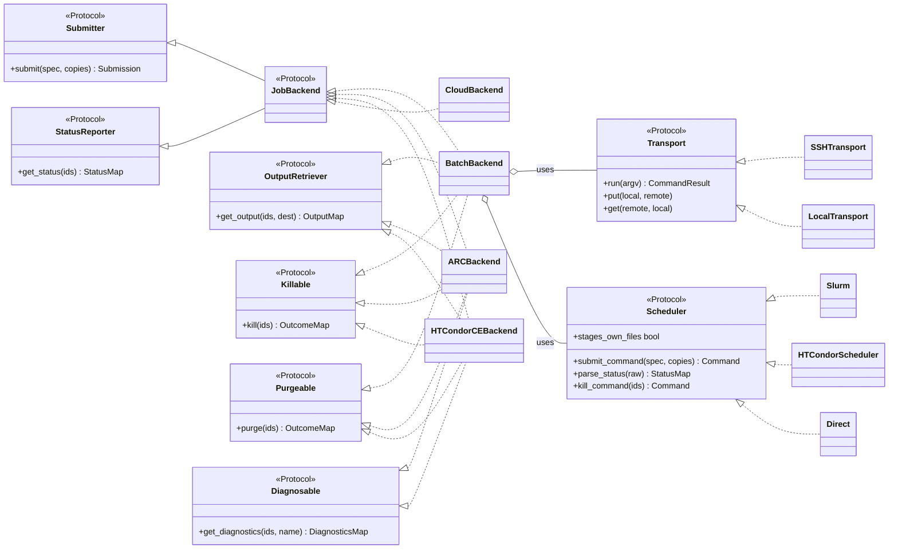

# IC-ADR-001: Computing Element interfaces and the DIRAC to interCEde migration

## Metadata

- **Created By:** Alexandre Boyer
- **Date:** 2026-06-30
- **Status:** Draft
- **Decision Maker(s):** Federico Stagni, Christophe Haen, Chris Burr
- **Stakeholders:** DIRAC/DiracX SiteDirector, PushJobAgent and Pilot maintainers; extension communities operating Computing Elements and batch systems; interCEde contributors

> **Scope, and how to read this.** This ADR sets a direction. It fixes the *shape* of interCEde's Computing Element interfaces. The code sketches show that shape only: exact signatures, wire formats and the per-backend work come later, in follow-up ADRs and in the code itself.
>
> interCEde is a standalone library in the [DIRACGrid](https://github.com/DIRACGrid) ecosystem. It provides the Computing Element layer used by [DiracX](https://github.com/DIRACGrid/diracx). Read it next to the DiracX transition ADRs, but note that it governs interCEde's own API. Why a standalone library and not a `diracx` subpackage: see Rejected Ideas.
>
> To review the decision, read the Abstract, the Motivation, and §1 to §4. The rest is reference material: the registry, the public API boundary, the consumer sketch, and the Rejected Ideas you do not want to argue with.

## Abstract

interCEde gives the workload management layer one way to submit, monitor and retrieve units of work. The same way works for Computing Elements, batch systems and cloud providers, and it never looks inside the payload. Backends are checked against real services running in containers.

The interface is built on four decisions:

1. **The contract is a small set of narrow typed interfaces ([`typing.Protocol`](https://typing.python.org/en/latest/spec/protocol.html#protocols)), not a base class.** A backend qualifies by having the right methods. It implements only the capabilities it has, and it can be replaced by a fake without importing interCEde types.
2. **Every operation is asynchronous and works on many jobs at once.** Filling site queues quickly is the requirement that shapes everything else.
3. **What a job produces and who moves it are separate questions.** The caller says, per output, whether it stays at the resource for us to collect or whether the resource sends it to storage directly.
4. **interCEde is a closed library, not a plugin framework.** There is one public API for consumers. Backends live in interCEde, so that every backend is covered by the container test suite of [IC-ADR-002](IC-ADR-002_integration_tests.md).

## Motivation

### What we have to support

1. **Fill site queues quickly, and keep them full.** A cycle places many units of work on many resources in a short time. Every operation is therefore asynchronous and works on many jobs at once. This is the requirement that shapes the whole contract.
2. **Find out what went wrong, quickly, and reproduce it.** When something fails we need its output and its logs, both while it runs and after it finishes, and we need to be able to run the same thing again by hand.
3. **Carry payloads of very different shapes.** At one end, a pilot: one small executable, almost no input, and output that is only a log. At the other, a VO payload on a cluster with no outside connectivity, where the worker nodes cannot reach storage themselves, so something else has to move the inputs and outputs for them.

The third case is the one that constrains the data plane most. "Let the payload fetch and push its own data" is not available when the nodes running it cannot reach the outside world, so the resource or interCEde has to do it.

### What the use cases require

- **Payload-agnostic.** interCEde must not care what the payload is. It submits an opaque executable plus a sandbox, and lets the caller poll, fetch or kill. A pilot and a pushed job differ only in what the caller puts in the sandbox.
- **Orchestration-agnostic.** Whether work is pulled or pushed is a workload management concern above interCEde, and so is deciding how many to send.
- **Bulk and asynchronous everywhere.** Submit, status, kill, purge and retrieval all take many jobs and return a result per job.
- **One contract, many backends**, with combinations treated as first-class.
- **Per-entity values at submission time.** One submission produces many jobs, and the caller has to be able to give each of them its own identity and its own secret.
- **The caller says where the data goes.** A backend that cannot move data to storage has to say so before the job runs, not after it finishes.
- **The request describes the environment, not just the command.** A container image is part of what the caller asks for, even though interCEde never looks inside it.
- **Tested against the real thing.** Backends are checked against schedulers running in containers, so the contract has to be easy to implement and easy to fake.
- **One codebase.** Backends live in interCEde and are added by contributing to it.
- **Typed and async.** DiracX is async, and results and errors should be typed.

## Specification

### 1. Scope: what interCEde is and is not

interCEde is the delegate-and-poll side of running work on a resource. You submit a payload to a scheduler or a resource, you get a handle, and then you poll it, fetch its sandbox, or kill it.

- **In scope:** reaching a resource (local shell, SSH, REST, a grid gateway, a cloud API); queueing work on a scheduler; tracking a remote handle; staging input and output sandboxes, either through interCEde or by asking the resource to stage them itself.
- **Out of scope, running here and now:** running a payload in this process on a worker node. That belongs to the pilot and worker-node domain, which has its own contract and shares no mechanics with this one.
- **Out of scope, orchestration:** pull against push, matching, pilot lifecycle. interCEde offers mechanism; the workload management system decides policy.
- **Out of scope, payload interpretation:** interCEde never inspects payload contents.
- **Out of scope, persistence:** interCEde keeps no store of jobs or handles. The caller stores handles and owns idempotency and reconciliation (§7).
- **Out of scope, data management:** interCEde moves bytes only between the caller and the resource. It does not resolve logical file names, choose storage, or register replicas. When the caller wants the resource to stage data (§2.3), it passes URLs it has already resolved.
- **Out of scope, other resource types:** storage and catalogues are different contracts, with different backends, tests and consumers.

Throughout this ADR, "job" means the scheduler's job, such as a Slurm or Condor job. It does not mean a DIRAC Job.

### 2. What you submit, and what you get back

The data types come first, because the protocols in §3 are expressed in terms of them. They are pydantic models, so that anything arriving from configuration or from a stored handle is validated rather than trusted.

```python
from collections.abc import Mapping, Sequence
from pathlib import Path

from pydantic import BaseModel

class Resources(BaseModel):
    cpus: int = 1
    memory_mb: int | None = None
    wall_time_s: int | None = None
    queue: str | None = None

class FileRef(BaseModel):
    name: str                        # the name this file gets in the working directory
    source: str                      # a local path, OR a URL the RESOURCE fetches itself

class ContainerSpec(BaseModel):
    image: str                       # "docker://...", a .sif path or URL, "oras://..."
                                     # interCEde never pulls, reads or builds the image.

class OutputMember(BaseModel):
    pattern: str                     # a name or a glob
    destination: str | None = None   # None: keep at the resource, for get_output().
                                     # A URL: the RESOURCE uploads it, and it never
                                     # reaches the consumer.

class OutputSpec(BaseModel):
    members: Sequence[OutputMember] = ()
    include_unlisted: bool = False   # anything else the payload leaves behind is kept too

class CopyVars(BaseModel):           # what differs between copies of ONE spec
    environment: Mapping[str, str] = {}   # per-copy identifiers, readable by the site
    secrets: Mapping[str, bytes] = {}     # per-copy file name -> content, staged at 0600

class SubmissionSpec(BaseModel):
    executable: str
    arguments: Sequence[str] = ()
    inputs: Sequence[FileRef] = ()
    outputs: OutputSpec = OutputSpec()
    resources: Resources = Resources()
    environment: Mapping[str, str] = {}
    container: ContainerSpec | None = None
    stdout: str | None = None        # the backend picks a unique name when this is None
    stderr: str | None = None
    tag: str | None = None           # consumer token for correlation and debugging only
```

**What "inputs" and "outputs" mean here.** They are the files the job reads and writes in its own working directory, and nothing else. `FileRef.name` and `OutputMember.pattern` always name a file in that directory. What may reach outside it is where a file comes from and where it goes: a source can be a URL the resource downloads, and a destination can be a URL the resource uploads to. So the inputs and outputs are the job's sandbox, while their sources and destinations may be remote storage. Neither field describes the payload's own data management: interCEde receives URLs the caller has already resolved (§1).

What comes back:

```python
class JobHandle(BaseModel):
    # The durable, serialisable identity of one job. The caller stores it and replays it
    # into later calls, so it has to survive across processes and carry whatever routing
    # the backend needs to find the job again, such as the host it was submitted to.
    ...

class Submission(BaseModel):
    handles: Sequence[JobHandle]     # handles[i] belongs to copies[i]
    failures: Mapping[int, str]      # copy index -> reason, for copies the backend refused

class JobOutput(BaseModel):
    stdout: Path | None
    stderr: Path | None
    log: Path | None                 # the scheduler or CE log, never a payload file
    files: Mapping[str, Path]        # payload members only

class OpOutcome(BaseModel):
    ok: bool
    reason: str | None = None
```

#### 2.1 Per-copy identity and secrets

Every submitted entity needs its own secret, and one `SubmissionSpec` producing many identical jobs cannot express that. So `submit()` takes `copies`, which is either a count or one `CopyVars` per copy, and `Submission.handles[i]` belongs to `copies[i]`. That is what lets the caller record which handle received which secret.

Two rules keep this safe and portable:

- **Identifiers go in `environment`, secret material goes in `secrets`.** A job's environment ends up in the job description, and the job description is readable by whoever can read the queue or by the site. An identifier is fine there. A secret is not, so it is delivered as a sandbox file with mode 0600 and never as a job attribute.
- **A backend that cannot vary a copy refuses the call.** Failing at submit is better than giving every copy the same secret.

#### 2.2 stdout and stderr

stdout and stderr are named members of the output sandbox. The caller may name them, and when it does not the backend picks a name that is unique per job.

The scheduler keeps them in its own part of the job description, separate from the output file list, so they do not collide there. The one place they can collide is `include_unlisted`, which sweeps up whatever the payload left in the working directory. So the rule is narrow: `include_unlisted` never picks up stdout, stderr or the scheduler log, and `JobOutput` returns them as their own fields, with `.files` holding payload members only.

#### 2.3 Who moves the data

`OutputMember.destination` answers the question "who moves this?", once, per file.

- **`destination is None`** means the file stays at the resource until somebody collects it. Collecting it needs `OutputRetriever` (§3).
- **`destination` is a URL** means the resource uploads the file itself, to a location the caller has already resolved. The bytes never pass through the consumer, so no temporary directory is needed for them.
- `inputs` works the same way in reverse. A `FileRef` whose source is a local path is staged by interCEde. A `FileRef` whose source is a URL is fetched by the resource.

Not every backend can do both. A batch system reached over SSH has no data stager of its own, so it can only keep files for collection. A cloud provider that boots a VM can do neither. The type system cannot express "this spec is compatible with this backend", so the backend validates the spec when `submit()` is called and refuses it there. That is a runtime check by necessity, and refusing at submit is the whole point: a job that cannot deliver its output should never start.

#### 2.4 Container images

`container.image` names the image the resource should run the executable in. interCEde does not pull it, read it or build it, so payload-agnosticism holds. There are three levels of support, declared per backend:

- **Native.** The scheduler or service has a field for it, and interCEde fills that field in.
- **Wrapped.** There is no native field, so the backend wraps the executable in a launcher command taken from its configuration, for example an `apptainer exec` line with the site's bind mounts already in it. The template is configured, never invented: bind mounts and options are site-specific, and guessing them would be worse than refusing.
- **Refused.** Neither is configured, so a spec carrying a `container` fails at submit rather than running the payload outside the image the caller asked for.

### 3. The contract: capability-segmented protocols

The rule of this ADR is never to force a backend to stub a capability it does not have.

Two capabilities are essential, because every usable backend has them and each one drives its own task: submit a payload with its inputs, and report the status of jobs.

```python
from collections.abc import Mapping, Sequence
from pathlib import Path
from typing import Protocol, runtime_checkable

StatusMap = Mapping[JobID, JobStatus]

@runtime_checkable
class Submitter(Protocol):
    async def submit(
        self, spec: SubmissionSpec, copies: int | Sequence[CopyVars] = 1
    ) -> Submission: ...
    # Submit the SAME spec several times. Pass a count for identical copies, or one
    # CopyVars per copy when each copy needs its own identity or secret (§2.1).
    # Different specs mean separate submit() calls: there is no mixed-batch overload.

@runtime_checkable
class StatusReporter(Protocol):
    async def get_status(self, ids: Sequence[JobID]) -> StatusMap: ...
    # Ids the backend no longer knows come back as JobStatus.UNKNOWN, never dropped.

@runtime_checkable
class JobBackend(Submitter, StatusReporter, Protocol): ...
```

`JobBackend` names a complete backend, and it is what the registry returns and validates. Consumers depend on the narrow protocol they use rather than on `JobBackend`: the submission task takes a `Submitter`, the status task a `StatusReporter`, and the output task an `OutputRetriever`, which it has to confirm structurally because a backend may not have one.

Everything else is optional and additive. Each optional protocol exists because some caller wants it on its own, and because there are backends that have it and backends that do not.

```python
@runtime_checkable
class OutputRetriever(Protocol):
    # Write into `dest` every output member the spec left at the resource (§2.3), plus
    # stdout, stderr and the scheduler log. Members the resource uploaded itself are not
    # part of this call. Returns one manifest per job, never file contents: this is the
    # only model that survives multi-GB output.
    #
    # `dest` is a directory the consumer owns and keeps, normally one per batch of jobs,
    # for example a per-cycle working directory it later uploads from. interCEde writes
    # into it and never deletes it.
    async def get_output(self, ids: Sequence[JobID], dest: Path) -> Mapping[JobID, JobOutput]: ...

@runtime_checkable
class Killable(Protocol):
    async def kill(self, ids: Sequence[JobID]) -> Mapping[JobID, OpOutcome]: ...

@runtime_checkable
class Purgeable(Protocol):
    # Release a job's outputs and remote state without collecting them.
    async def purge(self, ids: Sequence[JobID]) -> Mapping[JobID, OpOutcome]: ...

@runtime_checkable
class Diagnosable(Protocol):
    # Read a file BEFORE the job completes. Repeatable and non-destructive, and the only
    # streaming read in the contract. A grid CE offers this through a diagnostics
    # endpoint; a container orchestrator offers it as following a pod's logs.
    async def get_diagnostics(
        self, ids: Sequence[JobID], name: str | None = None
    ) -> Mapping[JobID, Diagnostics]: ...
```

**Retrieval is repeatable on every backend.** One scheduler removes a completed job from its queue as soon as its spooled files are collected, which would make collection one-shot there and nowhere else. That behaviour is configurable: the submit description can ask for the job to stay in the queue after collection, and interCEde sets that at submit time on every job it owns. So collecting output twice is safe everywhere, and the consumer never has to know which backends would otherwise lose the output, or treat a local directory as a commit point.

The cost is that completed jobs accumulate until something releases them, which makes `purge()` part of the normal flow rather than a rarely used extra. That is the better failure mode: a queue that grows is visible and recoverable, and output collected once and then deleted is neither. This needs confirming against a real scheduler in the IC-ADR-002 stacks before the wording is final.

**Partial failure is per item, not per batch.** A bulk call raises a typed exception only when the whole operation fails, for example when the transport is down or authentication is rejected. Anything that can succeed for some ids and fail for others is reported in the returned map: `get_status` gives `JobStatus.UNKNOWN` for ids it no longer knows, and `kill`, `purge` and `get_output` give a per-id `OpOutcome`.

How much detail we get varies by backend, and interCEde makes up the difference. A REST interface that accepts a list of ids and answers with a status code per id gives the map directly. A command-line tool that takes many ids reports its results as text, and bulk operations through some client libraries return counts rather than per-id outcomes. Where the backend does not say which id failed, interCEde re-reads the status of the batch after the operation and derives the map from that. The contract is per-id everywhere; only the quality of the reason varies.

Submit is the one place where granularity depends on the backend. A backend that submits a whole batch as one unit either succeeds or raises a whole-operation error, with no partial copies. A backend that submits one job at a time can partly succeed and then fill `Submission.failures`, keyed by copy index.

**Limits live in the backend's configuration.** `include_unlisted` collects filenames chosen by a payload that interCEde never inspects. Collection therefore needs four limits: a size ceiling, a file-count ceiling, a per-transfer timeout, and path containment, so that every member lands under `dest` and members naming absolute or parent paths are rejected.

These are deployment policy, not a per-call argument: a limit the caller passes is a limit the caller can raise. They are part of the configuration the registry validates (§5). How much can be enforced during the copy depends on who does it. Where interCEde streams file by file, all of it applies mid-transfer. Where the backend's own tool does the transfer, enforcement is a submit-time allow-list, a timeout, and a check afterwards.

**Backends have an explicit lifecycle, because consumers cache them.** Backends and transports hold connections and sessions, so they are async context managers. Construction is cheap and does no I/O. Close is idempotent. A consumer that caches backends closes them on eviction. The only state a backend holds is connections, released at a known point, and never job state.

**Results are typed, and async is the single model.** Whole-operation failures raise a typed exception hierarchy rooted at `InterCEdeError`, and per-item outcomes come back in the bulk map. Every backend is I/O-bound and every call is bulk, so async is the natural model for polling and fetching many jobs at once. A synchronous client library is wrapped in a thread internally and never exposed as a second contract.

### 4. Backends: how the resources fit the contract

A backend is anything that satisfies `JobBackend`. Three families cover what we have.

**Composed backends: a transport and a scheduler.** Reaching a resource and queueing work on it are independent choices, so one generic backend combines them. This turns a matrix of transports times schedulers into a sum.

```python
@runtime_checkable
class Transport(Protocol):                  # internal: how we reach the resource
    async def run(self, argv: Sequence[str]) -> CommandResult: ...
    async def put(self, local: Path, remote: str) -> None: ...
    async def get(self, remote: str, local: Path) -> None: ...

@runtime_checkable
class Scheduler(Protocol):                  # internal: how work is queued
    stages_own_files: bool                  # does the scheduler move the sandbox itself?
    def submit_command(self, spec: SubmissionSpec, copies: Sequence[CopyVars]) -> Command: ...
    def status_command(self, ids: Sequence[JobID]) -> Command: ...
    def parse_status(self, raw: str) -> StatusMap: ...
    def kill_command(self, ids: Sequence[JobID]) -> Command: ...

class BatchBackend:
    def __init__(self, transport: Transport, scheduler: Scheduler) -> None: ...

_: type[JobBackend] = BatchBackend          # conformance is structural, and checked statically
```

`BatchBackend` does not inherit from `JobBackend`. Conformance is structural, which is what keeps implementations free of interCEde base classes, and the assignment above is how a type checker proves it.

A `Scheduler` builds commands locally and only argv and staged files cross the `Transport`, so the remote host needs the scheduler's command-line tools and a shell, and no Python. `stages_own_files` is how a scheduler says whether it moves the sandbox itself or leaves that to `Transport.put` and `get`, so the backend reads a flag instead of branching on which scheduler it holds.

`Direct` is a scheduler too: it starts the process, records its identifier and working directory, and reads back an exit status. Combined with an SSH transport it is the smallest end-to-end path through the library, with no daemon to install, which makes it the right target for debugging the transport and sandbox layers on their own.

**Monolithic backends: a service that already does both.** A grid CE reached over REST is a service in front of a batch system we do not see, so there is no transport and scheduler to separate. It implements `JobBackend` directly and keeps its client internal. These are the backends most likely to support resource-side staging (§2.3), because the service has a data mover of its own.

**Provider backends: no queue at all.** A cloud provider boots a virtual machine. There is no queue, and there is no filesystem interCEde controls afterwards, so it implements the two essential protocols and nothing else. It is not a composed backend either: the provider driver library already owns the "which provider" axis, and it is neither a transport, having no shell or filesystem, nor a scheduler, having no queue.

That last case is why output retrieval is optional. A backend with no server-side filesystem cannot serve a pull, and forcing it to declare one would mean a method that always fails.



### 5. Discovery: an internal registry

A backend is described by data, and the registry turns that data into an object.

```python
class Limits(BaseModel):                    # §3: deployment policy, not a per-call argument
    max_total_bytes: int = 10 * 2**30
    max_files: int = 10_000
    transfer_timeout_s: int = 3600

class MonolithicConfig(BaseModel):
    kind: Literal["arc", "htcondor-ce", "cloud"]
    endpoint: str
    container_launcher: str | None = None   # §2.4, when the backend wraps rather than
    limits: Limits = Limits()               # passing the image through natively

class ComposedConfig(BaseModel):
    kind: Literal["batch"]
    transport: Literal["ssh", "local"]
    scheduler: Literal["slurm", "htcondor", "lsf", "sge", "oar", "torque", "direct"]
    host: str | None = None
    queue: str | None = None
    container_launcher: str | None = None
    limits: Limits = Limits()

BackendConfig = Annotated[
    MonolithicConfig | ComposedConfig, Field(discriminator="kind")
]

def backend(config: BackendConfig, credentials: CredentialProvider) -> JobBackend: ...
```

How it resolves:

- **The name-to-class table is in interCEde, and it is closed.** It lists the backends, transports and schedulers the library ships. There is no entry-point group and no plugin discovery, because nothing outside interCEde registers a backend.
- **Configuration is validated, not trusted.** An unknown name, a missing endpoint or a scheduler that does not exist is an error at resolution time with a message naming the field, which is what the discriminated union above buys.
- **Lazy, typed lookup.** The registry imports only the one target a request names, so installing interCEde does not import every backend. Each resolved object is checked with `isinstance` against the relevant protocol at the boundary, so a mistake in the table fails immediately rather than at the first method call. That check confirms methods are present and nothing more; static typing over the whole library and the container suite of IC-ADR-002 are what actually hold the signatures still.
- **A composed backend needs no class of its own.** The registry builds the named transport and scheduler and wraps them, which is what keeps the count of classes a sum rather than a product.

### 6. Public API and internals

interCEde has a small, known set of consumers: DiracX, DIRAC during the transition, and its own tests. There are two levels, not three.

**Public API.** What consumers may import. Changes here follow SemVer.

- The protocols a consumer narrows on: `Submitter`, `StatusReporter`, `JobBackend`, `OutputRetriever`, `Killable`, `Purgeable`, `Diagnosable`.
- The data types of §2: `SubmissionSpec`, `OutputSpec`, `OutputMember`, `ContainerSpec`, `CopyVars`, `FileRef`, `Resources`, `Submission`, `JobHandle`, `JobID`, `JobStatus`, `StatusMap`, `JobOutput`, `OpOutcome`, `Diagnostics`.
- The registry function and its configuration models.
- The credential types of [IC-ADR-003](IC-ADR-003_credentials.md) that a consumer implements or receives.
- The exception hierarchy, rooted at `InterCEdeError`.
- The lifecycle rule: backends are async context managers.

**Internals.** Everything else. That includes every concrete backend, transport and scheduler, and the `Transport` and `Scheduler` protocols themselves: the registry builds them from configuration and a consumer never names them in code. It also includes command builders, output parsers, credential materialisation and retry machinery. Consumers reach all of it through configuration data, and it may change in any release.

Every public module declares `__all__`. Anything not in a public module's `__all__`, and any name starting with `_`, is internal.

Keeping the protocols public while the implementations are internal is deliberate. Consumers narrow on capability with `isinstance`, tests replace a backend with a fake without importing one, and a type checker holds every backend in the library to the same signatures.

### 7. Consumer interface

The consumer surface is the public protocols plus the registry. Here is the submission task; the status and output tasks follow the same resolve, narrow and drive pattern.

```python
from intercede import registry, Submitter

async def submission_task(resource, want, make_payload, mint_secret):
    ce: Submitter = registry.backend(resource, credentials)  # isinstance-checked at the boundary
    want = min(want, policy.slots(await store.count_active(resource)))   # our store, our policy
    spec = make_payload()
    copies = [
        CopyVars(
            environment={"PILOT_STAMP": stamp},   # readable by the site
            secrets={"pilot.secret": secret},     # staged 0600, never a job attribute
        )
        for stamp, secret in [await mint_secret() for _ in range(want)]
    ]
    sub = await ce.submit(spec, copies)
    await store.record(zip(sub.handles, copies))  # handle i belongs to copy i
    # sub.failures carries any copies the backend refused, keyed by copy index
```

Two properties of that sketch are the point of the design:

- **Throttling is the consumer's, with no help from the backend.** `want` is capped from the consumer's own store. The consumer knows what it submitted, so it never has to ask a resource how busy it is.
- **The window between submit and record belongs to the consumer, because interCEde is stateless.** A crash after `submit` returns but before `store.record` commits leaves jobs the consumer has no handle for. That window is accepted: an orphan pilot registers itself and costs a few redundant pilots, and an orphan payload is bounded wasted CPU. It does mean an orphan holds a secret nobody recorded, so those secrets have to be short-lived and revocable on the consumer's side.

## Rationale

- **Protocols instead of a base class.** What callers depend on is a contract. A Protocol expresses it without tying implementations to one of our base classes, and it lets a test replace a backend with a fake that imports nothing. `isinstance` against a runtime-checkable protocol gives a cheap gate at the registry boundary, and a real abstract base class stays available where forcing an override is genuinely wanted.
- **Composition for access and scheduler.** Inheritance would force a class per combination, or a fragile lattice of mixins. Composition turns the same coverage into a sum, and it is the direct expression of the promise that backends combine.
- **Capability segmentation, sized by real callers.** One protocol per capability that some caller wants on its own. The task split is the evidence: a status task wants `StatusReporter` and an output task wants `OutputRetriever`, each without `submit` and without the other. Segment no further than a caller justifies, and drop a capability when its caller disappears.
- **Data types before protocols.** The protocols are expressed in terms of the specification objects, so the objects are defined first. This is also why the types are pydantic models: the registry configuration and stored handles both arrive from outside the process, and validating them is cheaper than debugging them.
- **Separating what a job produces from who moves it.** Tying them together means a pushed payload's data crosses the consumer even when the resource could send it directly, and it lets a backend that cannot retrieve outputs accept a spec that asks for them. A destination per output member fixes both, and it costs nothing to implement, because the grid services already work this way.
- **One retrieval model rather than two.** Making collection repeatable everywhere removes a flag from the contract, removes a commit-point rule from every consumer, and trades an unrecoverable failure for a visible one.
- **The caller owns per-copy identity.** The secret is issued centrally, so the caller is the only party that can supply it. Carrying it in `CopyVars` also forces the distinction between an identifier, which may sit in a readable job attribute, and a secret, which may not.

## Rejected Ideas

- **One large interface with every method mandatory.** It forces a backend that lacks a capability to ship a method that always fails, which moves the discovery of that failure from submit time to run time.

- **Make interCEde extensible by third parties**, through entry points, a stable plugin API and a subclassable base class. A backend living outside interCEde cannot be in interCEde's CI, so it cannot have the container stack that IC-ADR-002 makes the condition for supporting a backend at all. In exchange for a plugin API we would freeze internal interfaces for code we cannot run, and ship a library whose behaviour depends on packages we have never seen. A closed set also removes the tiered public surface, the entry-point groups, the override-precedence rule and a convenience base class, which is a large amount of machinery for a library with two consumers. The accepted cost is that a VO with an in-house scheduler has to contribute it upstream.

- **A capability protocol for resource-side staging.** It would have no methods, only a declaration of which URL schemes the resource can reach, and nothing would ever call it: the backend has to validate the spec at submit in any case, so the consumer's pre-check would duplicate that and could not act on the answer. The scheme sets stay as plain data on the backend for the day a site-selection caller appears.

- **A `destructive` flag on retrieval.** It made the consumer responsible for knowing that one backend's collection was one-shot, and the price of forgetting was lost output. Configuring that backend to keep the job instead removes the flag and the failure mode together (§3).

- **Treat stdout and stderr as ordinary sandbox members.** They would be swept up by `include_unlisted` alongside payload files, and a payload writing a file of the same name would overwrite them.

- **Keep the worker-node execution modes under `JobBackend`**, even as a sibling branch. They run a payload here and now rather than delegating and polling, they serve a different caller, and they share no mechanics, so the common supertype would be fictitious.

- **Keep the CE layer inside DIRAC or diracx, with no standalone library.** A standalone library lets backend and CE version support ship on its own schedule, without a DiracX release, and it isolates the containerised test matrix from DiracX's CI. The cost is a second release train, SemVer overhead, and version skew between the two. We accept that cost. If DiracX ever becomes the only consumer and the transition is complete, folding the library back in-tree would be worth revisiting.

- **Adding storage or catalogue support to interCEde.** They are different contracts, with different backends, tests and consumers, and the need is already met elsewhere. A library boundary follows the contract, so interCEde stays with submit, monitor and retrieve. Passing a resolved URL to a resource that stages data itself (§2.3) does not cross that boundary: interCEde never resolves a logical name or chooses a storage endpoint.
